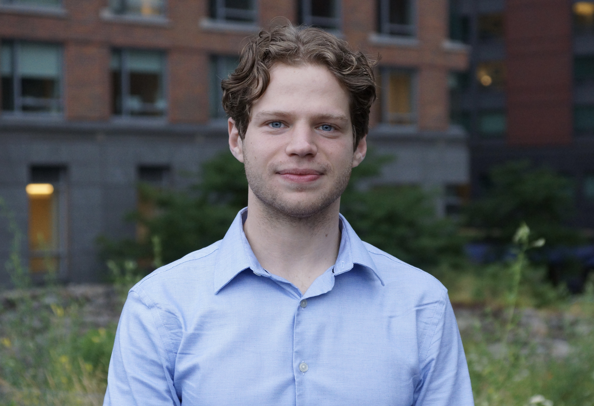

## Research Biostatistician at MSKCC
## Columbia University Mailman School of Public Health, M.S. in Biostatistics (May 2022)
## Hunter College, B.A. in Statistics & B.A. in Biochemistry (May 2019)

 

{width=50%}

 

### About

I am currently working as a Research Biostatistician at Memorial Sloan Kettering Cancer Center (MSKCC). A majority of my time is spent collaborating on projects involving hematologic malignancies, mainly assessing survival outcomes, efficacy of various treatments, bone marrow transplant outcomes, as well as infection rates. I also work on analyzing prostate cancer treatments and outcomes using SEER-Medicare data. My research interests include predictive modeling through machine learning and patient-reported outcomes. I am also a member of the Bridge to Biostats committee.

In May of 2022, I graduated from Columbia University with an M.S. in Biostatistics, with a concentration in Theory and Methods. In May of 2021, I was awarded the FORWARD Community Practicum Fellowship from Columbia University. In May of 2019, I received my B.A. from Hunter College in both Statistics and Biochemistry, with a Yalow Honors Scholarship, while also receiving Departmental Honors in Biochemistry and the Shirley Kurmin Mazur Award in Mathematics.

 

### Research

**Professional:** Throughout my time at MSKCC, I have over 50 publications, with an h-index of 10 and an i10-index of 11. Please see my [Google Scholar](https://scholar.google.com/citations?user=HV5IIrkAAAAJ&hl=en&oi=ao) page for more information.

**Graduate:** Conducted quantitative research for the Department of Population and Family Health at the Columbia Mailman School of Public Health on multiracial identification across various physical and mental health outcomes and covariates. Additionally, I was a research fellow for Hip Hop HEALS at Columbia University's Irving Medical Center. My research on this project included in-depth literature review on social and emotional learning (SEL) measurement scales for assessing outcomes, establishing data infrastructure, finalizing study design, and data analysis of pilot clinical trial data for efficient evaluation of intervention efficacy of the Be My Friend after-school multimedia modules administered by New York Edge.

**Undergraduate:** Conducted research for the Department of Chemistry on the removal of harmful radionuclides, such as technetium-99, which involved analytical chemistry and designing batch-study experiments.

 

### Projects

A few projects I've worked on during my time at Columbia include predicting heart disease using diagnostic tests, predicting survival on the infamous cruise ship, R.M.S. *Titanic*, predicting the outcome of the 2021 NCAA DI Men’s Basketball Tournament, building a website which compares COVID-19 case and death data to that of past pandemics, and creating a linear model to determine covariates responsible for hate crimes within the U.S. in 2016. You can see more info on these in the [Projects](https://david-nemirovsky.github.io/projects.html) tab.